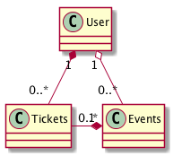

イベント告知アプリケーション
---

## 基本仕様
+ ユーザは作成されたイベント情報を閲覧することができる
  + デフォルトでは、開始時間が現在時刻以降のイベントが開始時間の昇順で表示される
  + 10件毎にページネーションする
  + イベント名および開始時間でイベントを検索し絞り込むことができる
+ ユーザはtwitterアカウントでログインできる
+ ログインしたユーザはイベントを作成できる
  + イベント情報として、イベントの作成者、イベントの名前（最大５０文字）、イベントの画像、開催場所（最大１００文字）、開始時間、終了時間、イベント詳細（最大２０００文字）、参加者一覧があり、すべてのユーザが閲覧することができる
+ ユーザは自分が作成したイベントであれば削除することができる
+ ログインしたユーザは作成されたイベントに参加できる
  + イベントに参加するときに、短いコメント（３０文字）を付けることができる
  + ログインしたユーザはイベントの参加をキャンセルすることができる
+ ログインしたユーザは退会することができる
  + ただし、関連する未開催のイベントが存在しないときに限る
+ 退会したユーザの情報は削除される
+ 退会したユーザが作成したイベントはそのまま残る
+ イベントを作成したユーザが退会している場合、作成したユーザの情報として「退会したユーザです」と表示される
+ イベントに参加したユーザが退会している場合、参加したユーザの情報として「退会したユーザです」と表示される

## ルーティング仕様
|パス|メソッド|内容|
|:---|:---|:---|
|/|GET|イベント一覧を表示する|
|/auth/:provider/callback|GET|ログイン/ユーザ作成処理を実行する|
|/logout|GET|ログアウトを実行する|
|/events/new|GET|イベント作成用フォームを表示する|
|/events|POST|イベント作成処理を実行する|
|/events/:id|GET|イベント詳細ページを表示する|
|/events/:id/edit|GET|イベント編集用のフォームを表示する|
|/events/:id|PATCH|イベント編集処理を実行する|
|/events/:id|DELETE|イベント削除処理を実行する|
|/events/:event_id/tickets|POST|イベント参加処理を実行する|
|/events/:event_id/tickets/:id|DELETE|イベント参加キャンセルを実行する|
|/user/retire|GET|退会用画面を表示する|
|/user|DELETE|退会処理を実行する|

## ユースケース

### イベント情報を閲覧する
### ログインする
### イベントを作成する
### イベントを削除する
### イベントに参加する
### 退会する

## コアモデル

