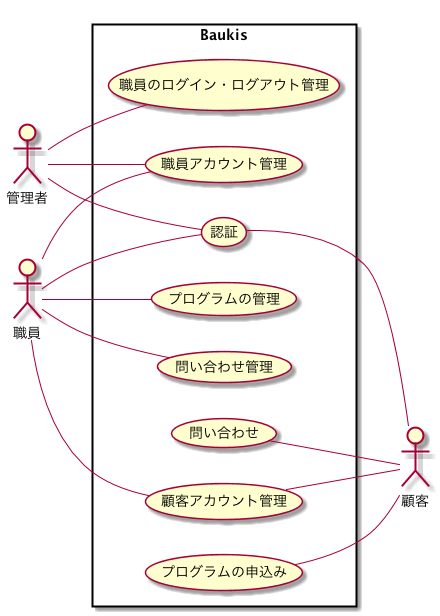
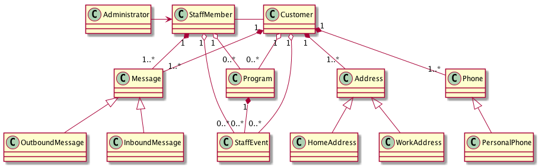

顧客管理システム Baukis
---

## 基本仕様
+ システムの利用者は、職員（staff members）と管理者（administrators）と顧客（customers）に分類される。
+ 職員は顧客の一覧を表示したり、特定の条件で顧客を抽出できる。
+ 職員は顧客の情報を追加・更新・削除できる。
+ 職員はタイトル、申込み開始日次、最大参加者数などを指定してプログラムを登録できる。
+ 管理者は職員を登録・更新・削除することができる。
+ 管理者は職員のログイン・ログアウト履歴を閲覧できる。
+ 顧客にはログイン用のアカウントが発行されている。
+ 顧客は企業への問い合わせを一覧表示できる。
+ 顧客は企業への問い合わせを検索できる。
+ 顧客は自分自身の個人情報を閲覧・修正できる。
+ 顧客はプログラム一覧から参加申し込みできる。

## ユースーケース

### 認証
### 職員アカウント管理
### 職員のログイン・ログアウト管理
### 顧客アカウント管理
### プログラムの管理
### 問い合わせ管理
### プログラムの申込み
### 問い合わせ

## コアモデル
