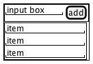

ビールリスト
---

## 基本仕様

+ BeerListContainer：最上位のラッパーコンポーネント
  + __InputArea：__inputとbuttonのラッパー
  + input：ごく普通のHTML5のinputタグ
  + button：ごく普通のHTML5のbutton
+ BeerList：項目のリスト（ルートはul）
  + li：各行は普通のli

## ユースケース

## コアモデル

## 参照
+ [ReactでTDD（テスト駆動開発）を始めよう : 環境構築からテスト作成、機能実装までの詳解ガイド](http://postd.cc/getting-started-with-tdd-in-react/)