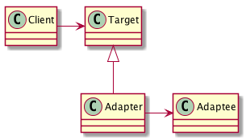
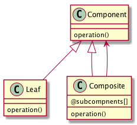
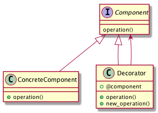
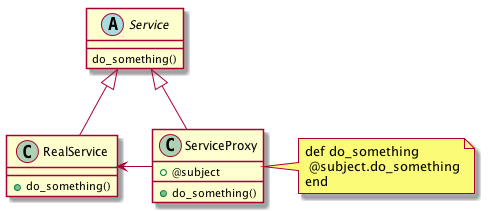
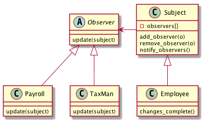
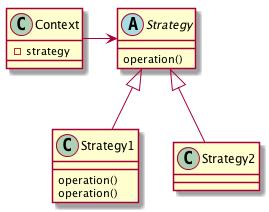
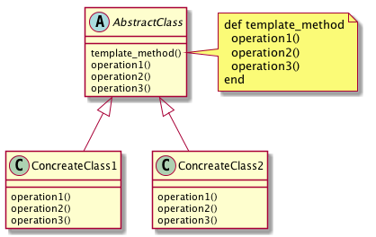

Rubyによるデザインパターン
---

### 生成に関するパターン
#### Abstract Factory	
関連する一連のインスタンスを状況に応じて、適切に生成する方法を提供する。

#### Builder	
複合化されたインスタンスの生成過程を隠蔽する。

#### Factory Method	
実際に生成されるインスタンスに依存しない、インスタンスの生成方法を提供する。

#### Prototype	
同様のインスタンスを生成するために、原型のインスタンスを複製する。

#### Singleton 
あるクラスについて、インスタンスが単一であることを保証する。

### 構造に関するパターン
#### [Adapter](./adapter.md)	
元々関連性のない2つのクラスを接続するクラスを作る。

#### Bridge	
クラスなどの実装と、呼出し側の間の橋渡しをするクラスを用意し、実装を隠蔽する。

#### [Composite](./composite.md)	
再帰的な構造を表現する。

#### [Decorator](./decorator.md)	
あるインスタンスに対し、動的に付加機能を追加する。Filterとも呼ばれる。

#### Facade	
複数のサブシステムの窓口となる共通のインタフェースを提供する。

#### Flyweight	
多数のインスタンスを共有し、インスタンスの構築のための負荷を減らす。

#### [Proxy](./proxy.md)	
共通のインタフェースを持つインスタンスを内包し、利用者からのアクセスを代理する。Wrapperとも呼ばれる

### 振る舞いに関するパターン
#### Chain of Responsibility	
イベントの送受信を行う複数のオブジェクトを鎖状につなぎ、それらの間をイベントが渡されてゆくようにする。

#### [Command](./command.md)	
複数の異なる操作について、それぞれに対応するオブジェクトを用意し、オブジェクトを切り替えることで、操作の切替えを実現する。

#### Interpreter	
構文解析のために、文法規則を反映するクラス構造を作る。

#### Iterator	
複数の要素を内包するオブジェクトのすべての要素に対して、順番にアクセスする方法を提供する。反復子。

#### Mediator	
オブジェクト間の相互作用を仲介するオブジェクトを定義し、オブジェクト間の結合度を低くする。

#### Memento	
データ構造に対する一連の操作のそれぞれを記録しておき、以前の状態の復帰または操作の再現が行えるようにする。

#### [Observer](./observer.md) 
(出版-購読型モデル)	インスタンスの変化を他のインスタンスから監視できるようにする。Listenerとも呼ばれる。

#### State	
オブジェクトの状態を変化させることで、処理内容を変えられるようにする。

#### [Strategy](./strategy_.md)	
データ構造に対して適用する一連のアルゴリズムをカプセル化し、アルゴリズムの切替えを容易にする。

#### [Template Method](./template_method.md)	
あるアルゴリズムの途中経過で必要な処理を抽象メソッドに委ね、その実装を変えることで処理が変えられるようにする。

#### Visitor
データ構造を保持するクラスと、それに対して処理を行うクラスを分離する。
