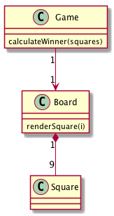

Tutorial: Intro To React
---

## 基本仕様
+ どちらのプレイヤーが勝ったかを表示する
+ ゲームのり履歴を保持する
+ プレイヤーは過去の履歴に戻ってゲームを再開することができる

## ユースケース

## コアモデル

## 参照
+ [Tutorial: Intro To React](https://facebook.github.io/react/tutorial/tutorial.html)