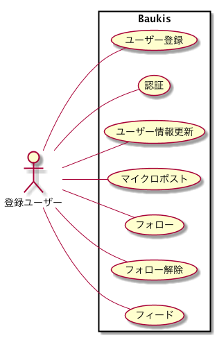
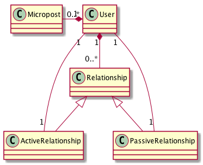

マイクロポストアプリケーション
---

## 基本仕様
+ サービス利用者はユーザー登録ができる。
+ 登録ユーザーはログインできる。
+ 登録ユーザーは自身の登録情報を更新できる
+ 登録ユーザーはマイクロポストができる。
+ 登録ユーザーは写真をアップロードできる。
+ 登録ユーザーは他の登録ユーザーをフォローをできる。
+ 登録ユーザーは他の登録ユーザーのフォローを解除できる。
+ 登録ユーザーはフォローしたユーザーのマイクロポストがフィードされる。

## ユースーケース

### ユーザー登録
### 認証
### ユーザー情報更新
### マイクロポスト
### フォロー
### フォロー解除
### フィード

## コアモデル
