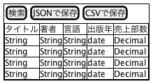

Excel：高機能な表コンポーネント
---

## 基本仕様

+ カラムをダブルクリックして編集できる
+ タイトル行をクリックして昇順・降順に並べ替えができる
+ AltまたはOption+Shift+Rで操作のリプレイができる
+ 表示内容の絞込検索ができる
+ JSON形式でダウンロードできる
+ CSV形式でダウンロードできる

## ユースケース

## コアモデル

## 参照
+ [Reactビギナーズガイド](https://www.oreilly.co.jp/books/9784873117881/)
+ [サンプルコード](https://github.com/stoyan/reactbook)
