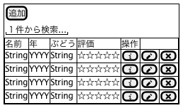
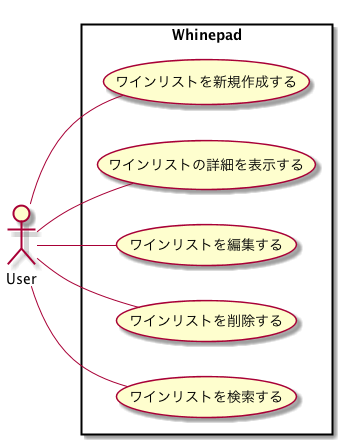
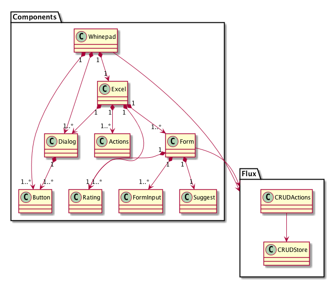

Whinepad
---

## 基本仕様

+ カラムをダブルクリックして編集できる
+ タイトル行をクリックして昇順・降順に並べ替えができる
+ 表示内容の絞込検索ができる
+ 項目を新規作成できる
+ 項目を詳細表示できる
+ 項目を編集できる
+ 項目を削除できる

## ユースケース

## コアモデル

## 参照
+ [Reactビギナーズガイド](https://www.oreilly.co.jp/books/9784873117881/)
+ [サンプルコード](https://github.com/stoyan/reactbook)