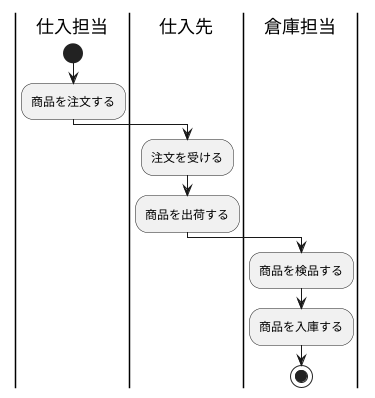
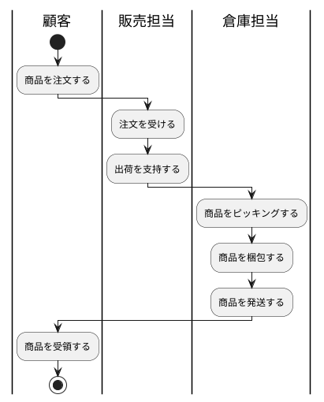
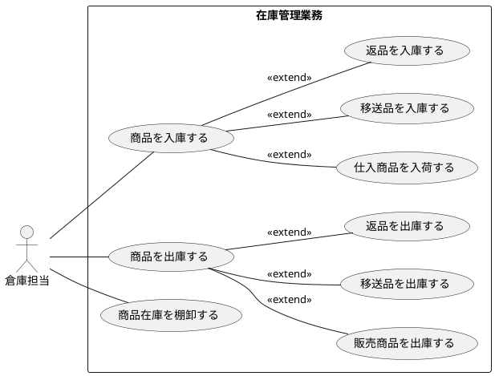
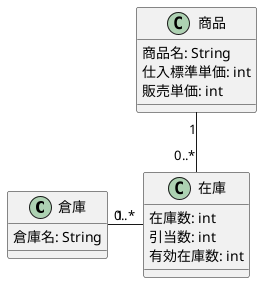
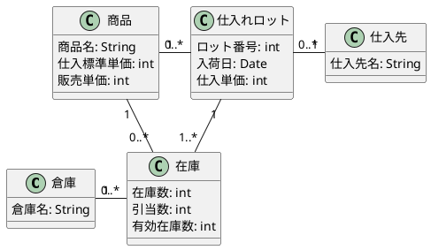
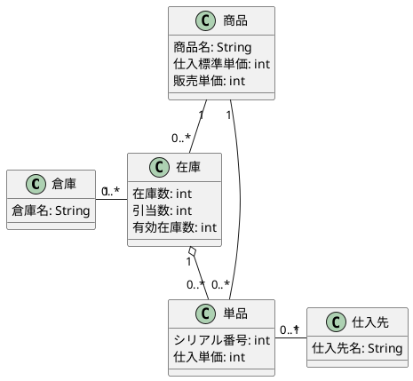
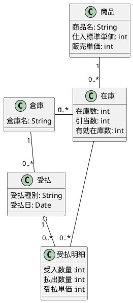
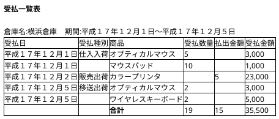
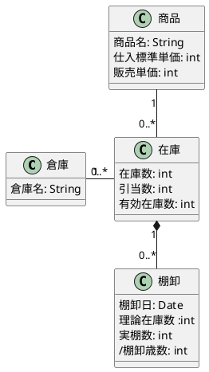

---
markdown:
  image_dir: ./assets
  ignore_from_front_matter: true
  absolute_image_path: false
---

[TOC]

SalesModeling
---
# 在庫管理業務の設計
## 要求
### 在庫管理の業務内容
1 仕入れ入庫


2 販売出荷


3 移送入庫／出庫

4 返品入庫／出庫

5 棚卸

6 そのほかの作業

### 在庫管理業務のユースケース


|No|ユースケース|概要|
|:---|:---|:---|
|UC-01|商品を入庫する|倉庫担当は倉庫宛に送付された商品が、種類／数量が正しいか、品質に問題がないかをチェックする。問題がなければ商品を所定の場所で保管する。|
|UC-02|仕入れ商品を入庫する|倉庫担当は、倉庫宛に送付されてきた商品が、仕入先に対する発注内容と、種類／数量が正しいか、品質に問題がないかをチェックする。問題がなければ商品を所定の場所で保管する。|
|UC-03|移送品を入庫する|倉庫担当は、ほかの倉庫から送付されてきた商品が、発注内容と、種類／数量が正しいか、品質に問題がないかをチェックする。問題がなければ商品を所定の場所で保管する|
|UC-04|返品を入庫する|倉庫担当は、顧客から返品されてきた商品が、出荷内容と、種類／数量が正しいか、品質に問題がないかをチェックする。問題がなければ商品を所定の場所で保管する。|
|UC-05|商品を出庫する|倉庫担当は、出荷指示において指定された種類／数量の商品をピッキングし、梱包して出庫する。|
|UC-06|販売商品を出荷する|倉庫担当は、出荷指示において指定された種類／数量の商品をピッキングし、梱包。納品書などの書類を添付して出荷する。|
|UC-07|移送品を出庫する|倉庫担当は、移送指示において指定された種類／数量の商品をピッキングし、梱包。送り状などの書類を添付して出荷する。|
|UC-08|返品を出荷する|倉庫担当は、返品指示において指定された商品をピッキングし、梱包。送り状などの書類を添付して仕入先に出荷する。|
|UC-09|商品在庫を棚卸する|倉庫担当は、商品在庫の実数を調査し、システムに登録する。|

### 有効在庫
有効在庫数 = 在庫数 - 引当数

### 予定在庫
予定在庫数 = （現在の）在庫数 - 引当数 + 予定日までの入荷数

## 分析
### クラス図
#### タイプ１：数量管理型

#### タイプ２：ロット管理型

#### タイプ３：単品管理型


#### 受払（タイプ１）


#### 受払一覧表の例


#### 棚卸



## 設計
### クラス図
```puml
class SalesService << DomainService >>{
}
class PurchaseService << DomainService >>{
}
class Supplier {
  name:String
  address:String
  telephone:String
}
class Warehouse {
  warehouse_name:String
}
class Product {
  name:String
  unit_purchase_price:int
  unit_sales_price:int
}
class OrderLot {
}
class Inventory {
}

SalesService -> Inventory
PurchaseService -> OrderLot
PurchaseService -> Inventory
OrderLot - Supplier
OrderLot -- Inventory 
OrderLot -- Product
Inventory -- Warehouse
```

### ER図
```puml
entity Supplier {
  + code [PK]
  --
  name
  prefecture
  city
  house_number
  telephone_number
  # supplier_type_category_code [FK]
}
entity Warehouse {
  + code [PK]
  --
  name
  order_id [FK]
  stock_id [FK]
  # warehouse_type_category_code [FK]  
}
entity Product {
  + code [PK]
  --
  name
  # product_type_category_code [FK]
  # brand_category_code [FK]    
  # season_category_code [FK]
  # year_category_code [FK]  
}
entity Sku {
  + code [PK]
  --
  unit_purchase_price_amount
  unit_purchase_price_currency
  unit_sales_price_amount
  unit_sales_price_currency        
  # product_code [FK]    
  # size_category_code [FK]
  # color_category_code [FK]  
}
entity Category {
  + code [PK]
  --
  name
  # parent_code [FK]
}
entity CategoryClass {
  + code [PK]
  --
  name
}
entity OrderLot {
  + lot_number [PK]
  --
  arrival_date
  unit_purchase_price_amount
  unit_purchase_price_currency
  # supplier_id [FK]
  # product_id [FK]
}
entity Inventory {
  id [PK]
  --
  amount
  unit
  allocation_amount
  allocation_unit
  available_amount
  available_unit
  # order_lot_id [FK]
  # warehouse_id [FK]
  # product_id [FK]
}
CategoryClass ||-do-{ Category
Product ||-do-{ Sku
Category ||-do-{ Sku
Category }-do-|| Category
Category||-do-{ Product
Category||-do-{ Supplier
Category||-do-{ Warehouse
Category||-do-{ Inventory
Supplier ||-do-{ OrderLot
Product ||-do-{ OrderLot
Product ||-do-{ Inventory
OrderLot ||-do-{ Inventory
Warehouse ||-do-{ Inventory
```
