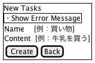

Todo2
---

## 基本仕様
+ タスクの作成ができる
  + 入力にエラーがある場合はエラーメッセージを表示する
+ タスクの一覧が表示ができる
+ タスクの詳細表示ができる
+ タスクの更新ができる
  + 入力にエラーがある場合はエラーメッセージを表示する
+ タスクの削除ができる

## ユースケース
### Todoタスクの作成

### Todoタスクの一覧

### Todoタスクの詳細表示

### Todoタスクの更新

### Todoタスクの削除

## コアモデル

## 参照
+ [パーフェクトRuby](https://www.amazon.co.jp/dp/B00P0UR1CA/ref=dp-kindle-redirect?_encoding=UTF8&btkr=1)